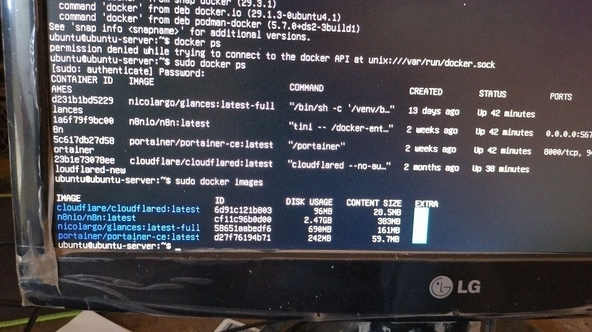
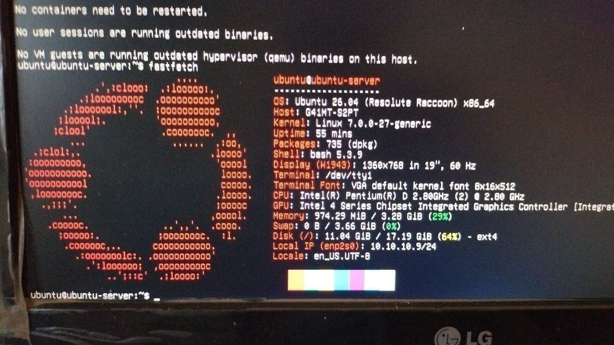
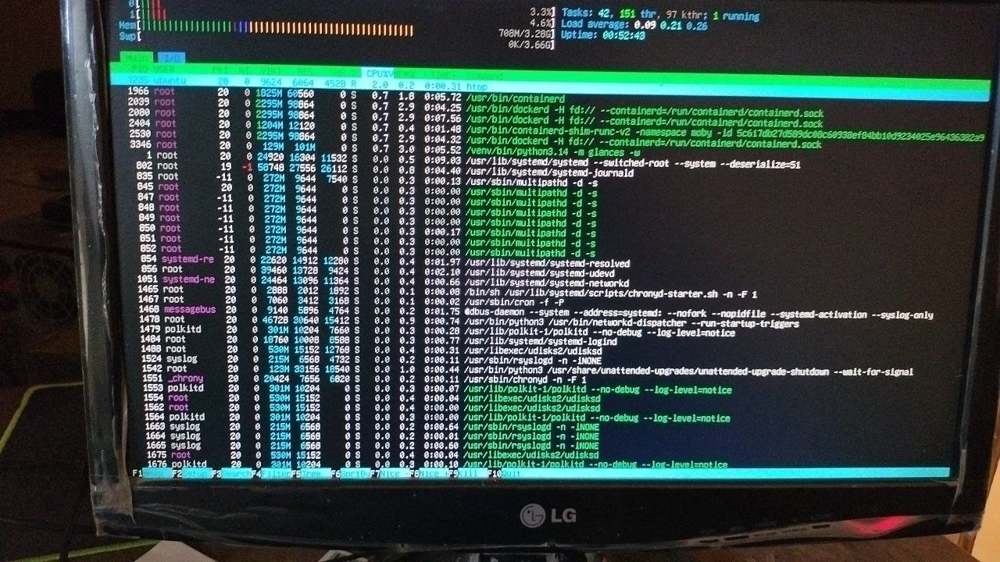
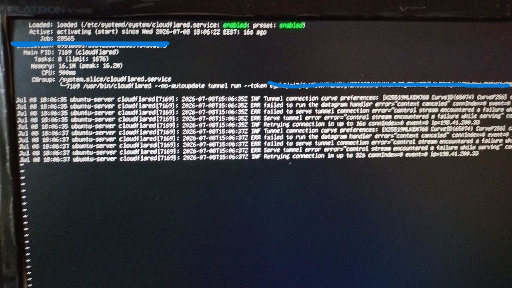

# Self-Hosted n8n Server

## Overview

This project documents the deployment and management of a self-hosted automation server running on Ubuntu Server.

The environment was configured on a physical machine and is used to host automation workflows using Docker containers.

---

## Technologies

- Ubuntu Server
- Docker
- n8n
- Cloudflare Tunnel
- Linux CLI
- DNS
- Networking

---

## Responsibilities

- Installed and configured Ubuntu Server
- Deployed Docker containers
- Hosted n8n
- Configured Cloudflare Tunnel
- Managed networking
- Troubleshot deployment issues
- Maintained server services

---

## Screenshots

### Docker Containers

### System Information

### Running Services

### Cloudflared

